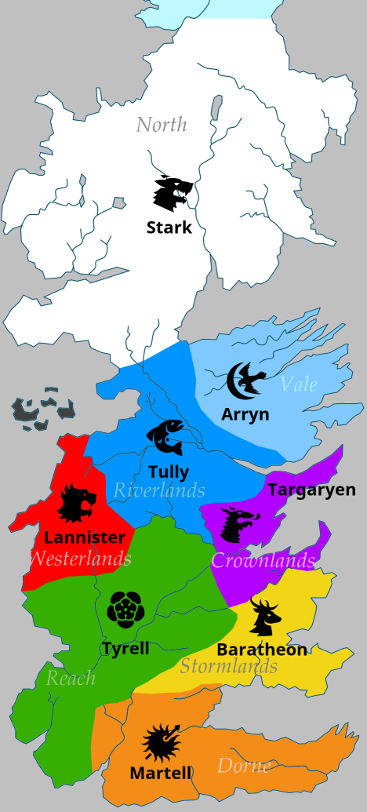

_Kata courtesy of blndr_

_Original here:_
https://gitlab.com/blndr/risk/


# Risk - Game of Thrones

_This is a simplification of a Risk - Game of Thrones edition (only Westeros is modelled with its seven kingdoms - plus the Crownlands - and dominant houses)._

__War is about to start, and no one - not even this piece of sh*t of Littlefinger - could predict its outcome.
You are the Many-face God, and can only be delighted for all the gifts your are about to receive.
You will witness the raging battles, the endless plots and betrayals from above.__

## Domain model

The domain model of the game is quite simple. It is modelled with 2 concepts :

* `House` : a powerful family of Westeros.
There may be up to 8 of them : Stark, Tully, Martell, Lannister, Tyrell, Baratheon, Arryn, Targaryen.
A given `House` owns an army of a certain number of battalions stationed on a given `Kingdom`.

* `Kingdom` : a region of Westeros that is controlled by one `House` and its army.
A given `Kingdom` is adjacent to some other `Kingdoms` : they can attack them.

## Game rules

* The playing order of the `Houses` will be determined randomly before the game starts
* A `House` occupying one `Kingdom` can attack another `House` occupying an adjacent `Kingdom`
* The game is over after 10 turns : the winner `House` is the one controlling the most `Kingdoms`
* After every turn, every `House` recruits a new battalion on every `Kingom` it owns

### Battle rules

* the attacking `House` engages half of its attacking `Kingdom` army (rounded down if odd)
  * there is one chance out of two that a battalion of the attacking army will defect at the last moment
* the defending `House` uses half of its defending `Kingdom` army (rounded up if odd)
  * there is one chance out of three that the defending army is helped by one sell-sword battalion
* the greater army wins

### Edge cases

* a given `House` on a given `Kingdom` cannot attack if it has 0 or 1 battalion
* a given `House` on a given `Kingdom` cannot attack the same `House` on another `Kingdom`

### Battle outcome

__The attacker wins__
  * its engaged battalions take possession of the newly conquered `Kingdom`
  * the newly conquered `Kingdom` receives a bonus of 1 battalion
  * the defending battalions are killed, the Many-face God feasts

__The defender wins__
  * the attacking battalions are killed, the Many-face God feasts
  * the defending army receives a bonus of 1 battalion

## Objectives

This is a many-face kata, there are steps to follow :
* write everything from scratch (with TDD)
  * would you rather use FP or OO ?
  * how will you model the game domain ?
  * which test list will help you the most ?
* once the requirements are fulfilled, try and apply a better design to the code
  * try to isolate the _business_ code from the _I/O_ code
    * you should be able to either log or print each turn by only changing one line of code
    * you should be able to use user `ìnputs` or random moves for each turn by only changing one line of code  
* add a new feature : the _Iron Islands - Greyjoy_ extension
  * the Iron Islands are adjacent to every coastal `Kingdom`
  * the Iron Islands cannot be conquered, house Greyjoy will always occupy it
    * if a `House` attacks them and win, Greyjoy's army drops to 0 battalions
  * their habit of _paying the iron price_ gives them a bonus of 2 battalions whenever they attack

## Game board

Here is the starting position of the game, right before Robert's Rebellion.



### Knowing nothing about GoT universe ?

No worries. This works just as well with any map from the real world, as long as you define territories (`Kingdoms`) and states (`Houses`).

## Install requirements
```
gradle build
```

## Unit test execution
```
gradle test
```